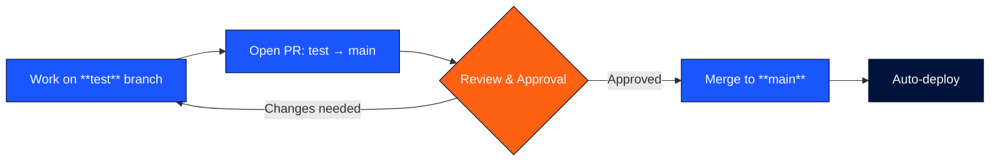

  

<h1 align="center">Blue Car Rental</h1>

  Internal software development organization. 
  How we build, test, and ship software — written for everyone on the team, regardless of technical background.

---

## Our Philosophy

Code is cheap now. Anyone on the team can build something with AI, and if those solutions benefit the company, that is fantastic. We encourage it.

But what our customers see must work. **Every time.**

The ability to write code quickly does not remove the need for careful judgment about what goes live. A broken feature, a security gap, or a bad deploy costs more than the time it takes to review a Pull Request. Our job is not to slow things down -- it is to make sure we ship with confidence.

---

## Branch Strategy

We use two branches. Think of them as two environments: one for work-in-progress and one for what our customers actually use.

| Branch | Purpose | Who can push | Deploys to |
|--------|---------|-------------|------------|
| `test` | Development and testing | Everyone | Nothing (safe to experiment) |
| `main` | Production | No one directly (PR only) | Live application |

---

## Workflow

### 1. Do Your Work on `test`

Write your code and make your changes on the `test` branch. You can also create a feature branch off of `test` if you prefer to work in isolation, then merge it back into `test` when you are done.

### 2. Open a Pull Request from `test` to `main`

When your changes on `test` are working correctly and ready for production, open a Pull Request (PR) targeting `main`. In the PR description, explain what the changes do and why they are being made.

### 3. Review and Approval

The development manager, Gudmundur (gudmundur@bluecarrental.is), reviews the Pull Request. He will check the changes for correctness, security, and overall quality. If anything needs to be fixed, he will leave comments on the PR.

### 4. Merge and Deploy

Once the PR is approved, it gets merged into `main`. The application automatically deploys from `main`, so your changes will be live shortly after the merge.

---

## Rules

> [!IMPORTANT]
> These rules are enforced at the repository level. They are not optional.

- **No direct pushes to `main`.** All changes to `main` must go through a Pull Request. No exceptions.
- **PRs to `main` require at least one approval.** A Pull Request cannot be merged until it has been reviewed and approved.
- **The development manager is the gatekeeper.** Gudmundur is responsible for approving changes before they reach production.
- **Force pushes to `main` are blocked.** You cannot rewrite the history of the production branch.
- **`main` cannot be deleted.** The production branch is permanently protected.

---

## What the Reviewer Checks

> [!NOTE]
> The review gate is how we balance speed with safety. Before anything reaches production, it must pass through a human review.

| Check | Question |
|-------|----------|
| **Correctness** | Does the change do what it claims to do? |
| **Security** | No vulnerabilities, no exposed secrets, no data leaks? |
| **Stability** | Does it break anything users already rely on? |
| **Readability** | Can someone understand this six months from now? |

This single approval step is the line between "work in progress" and "live in production." It protects our customers and it protects the business.

Build fast, but ship safely.
